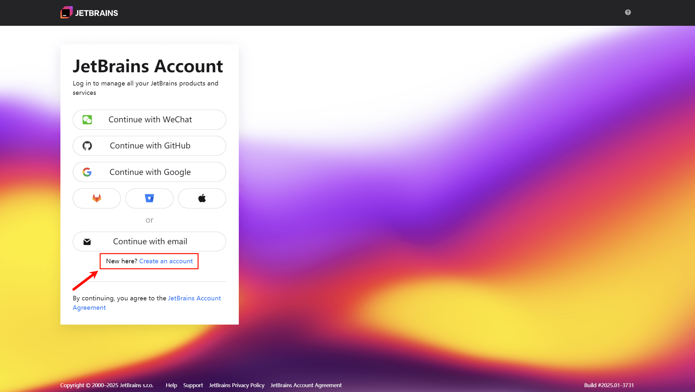

!!! abstract "JetBrains 教育许可证 [^1]"

    **JetBrains 教育许可证**是专门为教育机构、教师和学生设计的，旨在为他们提供免费或优惠的 JetBrains 产品许可证。
    通过教育许可证，教育机构和学生可以获得免费的 JetBrains IDE 和工具包，包括专业版和其他功能丰富的插件。具体而言，教育许可证可以获得以下优势：
    
    - **免费许可证**：获得为期一年的使用许可证，学生授权到期后如果还是在校状态可以申请续期。
    - **所有产品的访问**：允许访问 JetBrains 公司旗下所有的 IDE 产品，满足多种开发语言需求
    - **用于学习和项目开发**：可以将这些 IDE 用于学校课程作业、个人学习和非商业项目的开发中。
    - **活跃的社区支持**：可以参与专门为学生和教育工作者设置的社区论坛和资源中心，以便获得支持和交流意见。

---

## 1. 注册 JetBrains 账号

如果之前还未拥有 JetBrains 账号，需要在 [JetBrains 官方网站](https://account.jetbrains.com/login)进行注册 (1)
{ .annotate }

1. 建议使用国际常用邮箱（如 [Outlook](https://outlook.live.com)、[Gmail](https://mail.google.com)）进行注册，以广泛适用于国外网站

---

使用邮箱注册后，会收到一封邮箱确认验证码的邮件，将验证码填写至注册页面

!!! warning "可能是被视为垃圾邮件"

    如果许久还未提示收到相关邮件，可能是被视为垃圾邮件，可以检查垃圾邮件查看

---

按要求将账户信息填写完整后即可完成注册

---

## 2. 申请教育许可证（官方文件）

!!! abstract "教育许可证计划"

    JetBrain 提供了三种免费的教育许可证计划：

    - **面向学生和教师的个人许可证**
    - **面向教育机构的课堂许可证**
    - **面向训练营和商业培训课程的许可证**

!!! info "学生许可证申请要求"

    对于一般在校大学生，只需申请学生个人教育许可证，以下为申请要求：

    - **来自正规教育机构（高中、学院和大学）的学生和教职员工。**
    - **学生必须参加正规教育计划，该计划需要一年或多年全日制学习才能完成计划。**

     
    教育许可证说明：
    
    - **获取 JetBrains 出品的所有开发者工具的免费访问权限！**
    - **只能用于非商业教育目的。**
    - **只要您是学生或教师，就可以免费续订。**
    - **不能用于任何组织的产品或服务的开发。**
    - **不能与任何第三方共享。**

!!! example "申请方式 [^2] [^3]"

    申请免费教育许可证的可选方式：
    
    - **校园邮箱**
        - 如果您没有校园邮箱或是学校域名邮箱或如果不在 JetBrains 数据库内，系统会返回申请表格页面并红字标识。这时请改用其他的申请方式操作。
        - 如果贵校邮箱在 JetBrains 数据库内，系统会转到成功提交的提示页面，您会收到一封主旨为 “JetBrains Educational Pack Confirmation” 的邮件。请通过邮件内的链接操作确认申请，必须确认后才算申请成功。
    - **ISIC/ITIC（国际学生证/国际教师证）**
        - 系统核实证件有效后会转到成功提交的提示页面，您会收到一封主旨为 “JetBrains Educational Pack Confirmation” 的邮件。请通过邮件内的链接操作确认申请，必须确认后才算申请成功。
    - **官方文件**
        - 官方文件为人工审批，申请提交后 1～2 周会收到邮件通知处理结果。
        - 大学高校的在校学生必须提供学籍验证报告，学信网下载的 PDF 版带有效的验证码。
        - 大学高校的教师必须提供有效教职工证件、学校网站上的教师信息页面，或是教务系统内的教师信息和课程信息等。
    - **GITHUB**
        - 在 GITHUB 的学生开发包（GitHub Student Developer Pack）覆盖了 JetBrains 授权。请在 GITHUB 学生开发包的申请渠道操作。

---

### 下载学籍验证报告

访问[中国高等教育学生信息网（学信网）](https://www.chsi.com.cn)，并登录网站 (1)
{ .annotate }

1. 如果忘记密码，可以尝试使用微信扫码登录

---

在账号管理页面左侧，点击学信档案栏下的 **"在线验证报告"** 选项

---

在 **"教育部学籍在线验证报告"** 右侧点击 **"查看"** 按钮

---

!!! tip "申请在线验证报告"

    如果未申请在线验证报告，可以随时进行申请，参考：[如何申请在线验证报告_中国高等教育学生信息网（学信网）](https://www.chsi.com.cn/xlcx/rhsq.jsp)
    
    如果已申请的报告已过有效期，可以点击右侧 **"延长验证有效期"** 来重新设置有效期，如果仅临时使用建议设置 30 天有效期

在已申请的、有效期内有效的报告右侧点击 **"查看"** 操作查看报告

---

在报告右上方点击下载图标，下载教育部学籍在线验证报告的 PDF (1)，以备后续申请教育许可证使用
{ .annotate }

1. 报告语种选择默认的中文即可，无需翻译

!!! warning "请勿修改文件名"

    文件名格式为：`教育部学籍在线验证报告_姓名.pdf`，请勿修改文件名称和扩展名！

---

### 申请教育许可证

在 [JetBrains 免费许可证计划网站](https://www.jetbrains.com.cn/community/education)下方，点击 **"立即申请"** 跳转至申请页面

---

在申请表单**申请方式**选择 **"官方文件"** 方式，并要求填写所有必填项

!!! tip "填写说明"

    - 电子邮箱地址仅需填**常用邮箱**即可，无需教育邮箱
    - 学术机构名称和网站填写在读学校的**完整名称**和**官网地址**
    - 官方文件选择上传**教育部在线验证报告 PDF 文件**
    - 学信网报告在线验证码可以在**报告底部**查看

----

填写完成后，点击 **"申请免费产品"** 即可提交申请

!!! info "审核可能需要 1~2 周"

    官方文件为人工审批，申请提交后通常在一周（长则 1~2 周）内会收到邮件通知处理结果

---

如果收到如下邮件通知，则说明 JetBrains 教育许可证申请成功！

!!! warning "可能是被视为垃圾邮件"

    如果两周后还未提示收到相关邮件，可能是被视为垃圾邮件，可以检查垃圾邮件查看

---

可以点击邮件中的蓝色文字链接 `link your free license`，或直接访问 [JetBrains 账户网站](https://account.jetbrains.com/licenses)查看并将许可证连接至当前账户

!!! info "教育许可证说明"

    在教育许可证中，列出了许可证 ID（License ID）、许可证有效期（Valid through）以及此许可证包括的所有可以免费使用的产品。
    
    **注意：每个教育许可证仅有 1 年的有效期，可以在授权到期前几天（会有邮件提醒）在账户页面进行续期**
    
    许可证相关问题参见：<https://sales.jetbrains.com/hc/zh-cn>

---

## 3. 在 JetBrains IDE 激活许可证

以 CLion 为例，打开 CLion，在欢迎页面左下方点击更多按钮，并点击 **"管理许可证..."** 选项

---

在许可证界面，选择 CLion ，并选择从 **JetBrains Account** 获取许可证，点击 **"激活"** 即可

!!! tip "其他产品授权"

    教育许可证授权的其他产品或插件（如 Material Theme UI）也可以通过同样的方式激活

[^1]: [免费教育许可证 - 社区支持](https://www.jetbrains.com.cn/community/education)
[^2]: [学生和教师授权申请方式 – 许可和购买常见问题解答](https://sales.jetbrains.com/hc/zh-cn/articles/207154369)
[^3]: [2022 JetBrains 开发工具——学生授权免费申请指南 | The JetBrains Blog](https://blog.jetbrains.com/blog/2022/08/24/2022-jetbrains-student-program/)